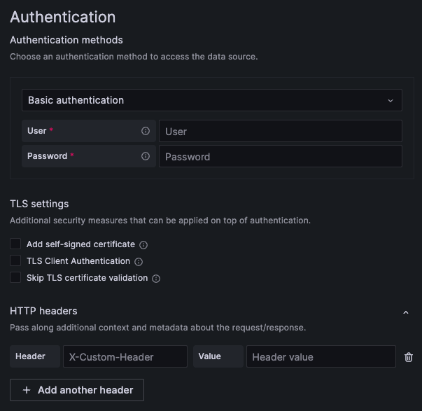

# Auth component

Auth component is meant to replace the old `DataSourceHttpSettings` component which has a number of UX issues. At the moment component is stored here in `@grafana/plugin-ui` so that it can be used in external datasources regardless of Grafana version (Enterprise datasources must support at least 2 latest major Grafana versions).

In the new component only one authentication method can be selected at a time and all TLS options are located in a separate section and can be added on top of any selected authentication method.

It is also possible to extend the component with custom Auth method. Read more in the "Adding custom Auth method" section.

This is how it looks like:



## Replacing the old DataSourceHttpSettings component with the new one

Even though the new component has completely different props shape, there is a special utility that takes the legacy props and returns the new props.

> ❗️Note: The new component only takes care about the Auth section of the old component (see screenshot above). So the HTTP section (URL, Allowed cookies, Timeout) need to be added alongside the new component separately when needed.

**Example**:

```tsx
import { Auth, convertLegacyAuthProps } from "@grafana/plugin-ui";

// Your config editor component
export const ConfigEditor = (props) => {
  return (
    <div>
      {/* Other component logic... */}

      <Auth
        {...convertLegacyAuthProps({
          config: props.options,
          onChange: props.onOptionsChange,
        })}
      />

      {/* Other component logic... */}
    </div>
  );
};
```

## Using new props

If you are not limited by the old component and just want to use the new one, you can pass the new props shape to the component yourself.

```ts
type Props = {
  // Currently selected method.
  // AuthMethod and CustomMethodId types are defined below.
  selectedMethod: AuthMethod | CustomMethodId;

  // Will render "(most common)" label near the specified method
  mostCommonMethod?: AuthMethod | CustomMethodId;

  // Helps to render only some selected auth methods.
  // Can also be used for reordering the list of auth methods.
  visibleMethods?: (AuthMethod | CustomMethodId)[];

  // Allows to render custom auth methods alongside default ones.
  // You can also use new component for rendering only custom auth methods.
  customMethods?: {
    id: CustomMethodId;
    label: string;
    description: string;
    component: ReactElement;
  }[];

  // Will be called when user selects auth method from the list
  onAuthMethodSelect: (authType: AuthMethod | CustomMethodId) => void;

  // Data and callbacks for rendering basic auth method
  basicAuth?: {
    user?: string;
    passwordConfigured: boolean;
    userTooltip?: PopoverContent;
    passwordTooltip?: PopoverContent;
    onUserChange: (user: string) => void;
    onPasswordChange: (password: string) => void;
    onPasswordReset: () => void;
  };

  // Data and callbacks for rendering the TLS settings section
  TLS?: {
    selfSignedCertificate: {
      enabled: boolean;
      certificateConfigured: boolean;
      onToggle: (enabled: boolean) => void;
      onCertificateChange: (certificate: string) => void;
      onCertificateReset: () => void;
    };
    TLSClientAuth: {
      enabled: boolean;
      serverName: string;
      clientCertificateConfigured: boolean;
      clientKeyConfigured: boolean;
      onToggle: (enabled: boolean) => void;
      onServerNameChange: (serverName: string) => void;
      onClientCertificateChange: (clientCertificate: string) => void;
      onClientKeyChange: (clientKey: string) => void;
      onClientCertificateReset: () => void;
      onClientKeyReset: () => void;
    };
    skipTLSVerification: {
      enabled: boolean;
      onToggle: (enabled: boolean) => void;
    };
  };

  // Data and callback for rendering the custom headers section
  customHeaders?: {
    headers: Header[];
    onChange: (headers: Header[]) => void;
  };
};

// Default auth methods
enum AuthMethod {
  NoAuth = "NoAuth",
  BasicAuth = "BasicAuth",
  OAuthForward = "OAuthForward",
  CrossSiteCredentials = "CrossSiteCredentials",
}

// All custom auth method ids should have `custom-` prefix
type CustomMethodId = `custom-${string}`;

// Used in `customHeaders` Props field
type Header = {
  name: string;
  configured: boolean;
  value?: string;
};
```

If `TLS` property in `Props` object is not passed, the TLS settings section will not be rendered.

If `customHeaders` property in `Props` object field is not passed, custom headers section will not be rendered.

## Adding your own auth methods

You can extend the component with your custom auth method(s) by passing it to the `Props` under `customMethods` array. Your custom methods will be rendered as a part of the methods list. Once user selects your custom method, the respective component will be rendered.

`customMethods` is an array of the following object shape:

```ts
type CustomMethod = {
  id: `custom-${string}`;
  label: string;
  description: string;
  component: ReactElement;
};
```

It's up to you to fill your custom component with data and add callbacks to store the data where needed.

If you are migrating from the old `DataSourceHttpSettings` component (e.g. use `convertLegacyAuthProps`) and want to add custom methods at the same time, you will need to add a bit of logic to make it work. Here is the example:

```tsx
const ConfigEditor = () => {
  const newAuthProps = convertLegacyAuthProps({
    config: props.options,
    onChange: onOptionsChange
  });

  return (
    {/* Other component logic... */}

    <Auth
      // Reshaped legacy props
      {...newAuthProps}

      // Still need to call the method from `newAuthProps` to store
      // the legacy data correctly. Also make sure to store the data
      // about your component being selected/unselected.
      onAuthMethodSelect={(method) => {
        newAuthProps.onAuthMethodSelect(method);
        setSigV4Selected(method === sigV4Id); // <-- change this accordingly
      }}

      // If your method is selected pass its id to `selectedMethod`,
      // otherwise pass the id from converted legacy data
      selectedMethod={sigV4Selected ? sigV4Id : newAuthProps.selectedMethod}

      // Your custom auth methods
      customMethods={[
        {
          id: sigV4Id,
          label: "SigV4 auth",
          description: "This is SigV4 auth description",
          component: (
            <>
              <div>SigV4 fields</div>
              {/* Make sure you render the values and store the data when it changes */}
              <Input
                placeholder="SigV4 field"
                value={props.options.jsonData.YOUR_VALUE}
                onChange={(e) => {/* Make sure to store the data */}}
              />
            </>
          ),
        },
      ]}
    />

    {/* Other component logic... */}
  );
};
```
