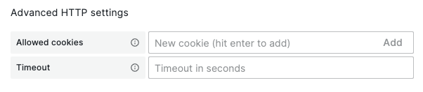

# AdvancedSettings

Contains components to be used for datasource advanced configuration.

## AdvancedHttpSettings

### Overview

`AdvancedHttpSettings` component is used to simplify migrating from legacy `DataSourceHttpSettings` component (you can find the detailed explanation [here](../migrating-from-datasource-http-settings.md)).
`AdvancedHttpSettings` renders as a config **sub section** with "Allowed cookies" and "Timeout" fields.

> ❗️ Note: `AdvancedHttpSettings` should be used inside "Additional settings" config section alongside sub sections for other advanced datasource settings (see [usage example](#usage) below).

`AdvancedHttpSettings` has the following properties type:

```ts
type Props = {
  // This is passed as `props.options` to datasource's ConfigEditor component
  config: DataSourceConfig;

  // This is passed as `props.onOptionsChange` to datasource's ConfigEditor component
  onChange: DataSourceConfigOnChangeHandler;

  // Optional className
  className?: string;
};
```

### Usage

The common scenario if you are just replacing the legacy `DataSourceHttpSettings` component is as simple as:

```tsx
import {
  ConfigSection,
  ConfigSubSection,
  AdvancedHttpSettings
} from '@grafana/plugin-ui'


export const ConfigEditor = (props: Props) => {

  return (
    {/* ... */}

    <ConfigSection
      title="Advanced settings"
      description="Additional settings are optional settings that can be configured for more control over your data source."
    >
      {/* Other sub sections if applicable */}

      <AdvancedHttpSettings
        config={props.options}
        onChange={props.onOptionsChange}
      />

      {/* Other sub sections if applicable */}
    </ConfigSection>

    {/* ... */}
  )
}
```

### How it looks like


