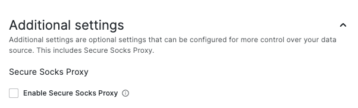

# ConfigSection

## Overview

Exposes two components, `ConfigSection` and `ConfigSubSection` that are used to organize data source configuration page.

The properties type for both components is the same:

```ts
type Props = {
  // Section title
  title: string;

  // Section description
  description?: ReactNode;

  // Defines whether section is collapsible
  isCollapsible?: boolean;

  // Defines whether collapsible section is initially open (on page load)
  isInitiallyOpen?: boolean;

  // Optional className
  className?: string;

  // Should always have child components
  children: ReactNode;
};
```

The section description property is optional, but it should only be omitted if there is only one field in the section.

## Usage

```tsx
import {ConfigSection, ConfigSubSection} from '@grafana/experimental'


export const ConfigEditor = (props: Props) => {

  return (
    {/* ... */}

    <ConfigSection
      title="Connection"
    >
      <ConfigSubSection title="URL">
        {/* URL field */}
      </ConfigSubSection>
    <ConfigSection/>

    <ConfigSection
      title="Additional settings"
      description="Additional settings are optional settings that..."
      isCollapsible
      isInitiallyOpen={!!(props.options.jsonData.someSetting)}
    >
      <ConfigSubSection title="Some setting">
        {/* Some setting fields  */}
      </ConfigSubSection>
    <ConfigSection/>

    {/* ... */}
  )
}
```

## How it looks like


