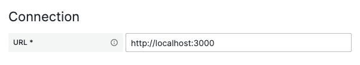

# Connection

Contains components to be used for datasource connection configuration.

## ConnectionSettings

### Overview

`ConnectionSettings` component is used to simplify migrating from legacy `DataSourceHttpSettings` component (you can find the detailed explanation [here](../migrating-from-datasource-http-settings.md)).
`ConnectionSettings` renders as a config section with only on field for the URL.

> ❗️ Note: If you are not migrating from `DataSourceHttpSettings` or if you need to add more fields to the "Connection" section for your datasource, then it's better that you create your own implementation of the component.\
> `ConnectionSection` stores the URL not inside `jsonData` but right inside the config object of the datasource, which might be not what you want if you are for example creating the datasource from scratch.

`ConnectionSettings` has the following properties type:

```ts
type Props = {
  // This is passed as `props.options` to datasource's ConfigEditor component
  config: DataSourceConfig;

  // This is passed as `props.onOptionsChange` to datasource's ConfigEditor component
  onChange: DataSourceConfigOnChangeHandler;

  // Optional description for the config section
  description?: ReactNode;

  // Optional  placeholder for the URL input
  urlPlaceholder?: string;

  // Optional tooltip for the URL input
  urlTooltip?: PopoverContent;

  // Optional label for the URL input
  urlLabel?: string;

  // Optional className
  className?: string;
};
```

### Usage

The common scenario if you are just replacing the legacy `DataSourceHttpSettings` component is as simple as:

```tsx
import {ConnectionSettings} from '@grafana/experimental'


export const ConfigEditor = (props: Props) => {

  return (
    {/* ... */}

    <ConnectionSettings
      config={props.options}
      onChange={props.onOptionsChange}
    />

    {/* ... */}
  )
}
```

### How it looks like


