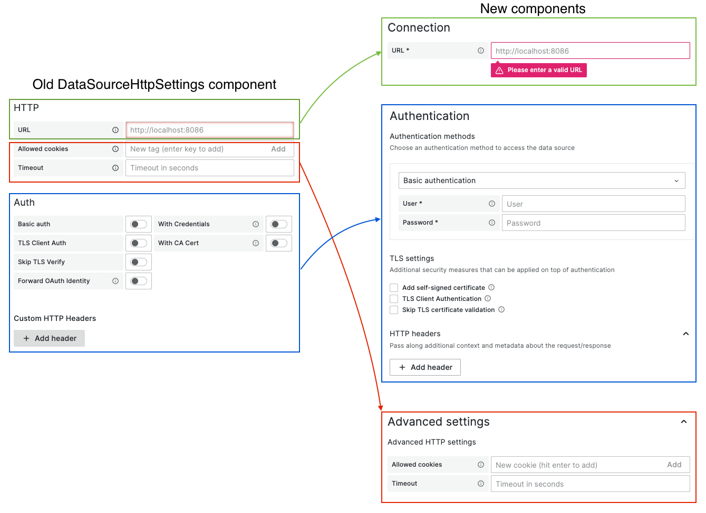

# Migrating from DataSourceHttpSettings component

## Overview

As `DataSourceHttpSettings` has a number of UX issues and is considered deprecated, `@grafana/experimental` package has a few components that will help you to migrate away from it. The new components are stored here in `@grafana/experimental` so that they can be used in both core and external datasources regardless of Grafana version (Enterprise datasources must support at least 2 latest major Grafana versions).

According to the [datasource configuration best practices](https://docs.google.com/document/d/11XMaYHSMSra8AoN2-yVW-5QPbjEXgkAFbTIF6N84cGE/edit) the data source configuration page should consist of multiple sections, so there is no single component that can just replace `DataSourceHttpSettings` component. Instead, there are 3 components that will take care of different parts of the `DataSourceHttpSettings` and they can be placed in different places inside the datasource config editor. This is how mapping old -> new looks like:



New components are:

- [ConnectionSettings](./Connection)
- [Auth](./Auth)
- [AdvancedHttpSettings](./AdvancedSettings)

Each of the component has it's own README file and some components (like `Auth`) are highly configurable, so feel free to explore the docs.

## Usage example

This is how the simple migration would look like. You need to remove the old component:

```tsx
<DataSourceHttpSettings
  dataSourceConfig={props.options}
  onChange={props.onOptionsChange}
  // ... other props
/>
```

The new components usage looks like this:

```tsx
import {
  ConfigSection,
  ConnectionSettings,
  Auth
  AdvancedHttpSettings,
  convertLegacyAuthProps,
} from '@grafana/experimental'

export const ConfigEditor = (props: Props) => {
  // ...

  return (
    {/* ... */}

      <ConnectionSettings
        config={props.options}
        onChange={props.onOptionsChange}
      />

      <Auth
        {...convertLegacyAuthProps({
          config: props.options,
          onChange: props.onOptionsChange,
        })}
      />

      {/* Other sections if applicable */}

      <ConfigSection
        title="Advanced settings"
        isCollapsible
        isInitiallyOpen={/* if any of the advanced settings is enabled */}
      >
        {/* Other sub sections if applicable */}

        <AdvancedHttpSettings
          config={props.options}
          onChange={props.onOptionsChange}
        />

        {/* Other sub sections if applicable */}
      </ConfigSection>

    {/* ... */}
  )
}
```

> ❗️ Note: As data sources might have different advanced options, a decision was made to provide `AdvancedHttpSettings` as a sub section and not as a whole section, so that other advanced settings can be added alongside advanced HTTP settings. This means that you need to create "Advanced settings" section that wraps `AdvancedHttpSettings` yourself (like in the example above).

## More complex migrations

In case you need to add more fields inside `ConnectionSettings` section or inside `AdvancedHttpSettings` you will need to implement those components yourself. Feel free to copy the code from the existing implementation and extend it with the fields you need.

In case you have some custom auth methods or you use some exotic auth methods from `DataSourceHttpSettings` component (like Sigv4), you can add those to the new `Auth` component as custom auth methods alongside default ones. This example is described in the [README of the `Auth` component](./Auth/README.md).
